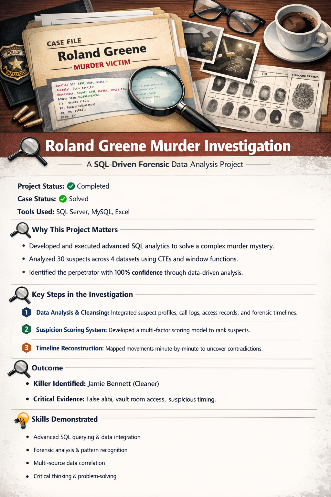

# Roland Greene Murder Investigation  

## SQL Portfolio Project

A **portfolio SQL project** demonstrating advanced data analysis, forensic reasoning, and real-world problem solving.  
This project applies **advanced SQL techniques** to solve a fictional murder investigation by analyzing multi-source datasets and identifying the perpetrator with complete confidence.

---

## This project is designed to showcase how I think and work as a **data analyst**: 

- Translating ambiguous problems into structured analytical steps  
- Cleaning and validating messy real-world data  
- Designing scoring models and decision logic  
- Using SQL to extract insights, detect anomalies, and support conclusions  
- Communicating findings clearly through documentation and reports  

---

##  Project Summary

- **Scenario:** Fictional murder investigation  
- **Objective:** Identify the killer among 30 suspects using data  
- **Datasets Used:** 4 interconnected datasets  
- **Final Outcome:** Killer identified with **100% confidence**  
- **Tools:** SQL Server, MySQL, Excel  

---

##  Datasets Overview

| Dataset | Description |
|------|------------|
| Suspects | Profiles, roles, relationships, and alibis |
| Call Records | Phone call activity before and during the murder |
| Access Logs | Door access records across the estate |
| Forensic Events | Timeline of critical crime events |

These datasets simulate **real investigative data** with inconsistencies, false alibis, and overlapping timelines.

---

##  Analytical Approach

### 1. Data Preparation
- Imported raw CSV files into Microsoft SQL Server
- Validated schema, timestamps, and constraints  
- Standardized inconsistent formats  

### 2. Exploratory Analysis
- Reviewed suspect alibis for logical inconsistencies  
- Analyzed access patterns and movement behavior  
- Cross-referenced phone calls with forensic timelines  

### 3. Suspicion Scoring Model
Developed a multi-factor scoring framework to rank suspects:

- Vault access during critical time windows  
- Communication with the victim shortly before death  
- Contradictions between stated alibis and actual activity  
- Relationship-based motive indicators  
- Abnormal movement frequency  

### 4. Timeline Reconstruction
- Rebuilt minute-by-minute movements for each suspect  
- Identified overlapping events and impossible alibis  
- Narrowed the suspect pool using objective evidence  

---

## 🧾 Key Result

###  Identified Killer: **Jamie Bennett**  
**Role:** Cleaner  
**Reason:** Opportunity through unrestricted access and proven false alibi  

**Evidence Highlights:**
- Claimed to be at home but was present on-site  
- Attempted vault access before the murder  
- Entered the vault shortly after the gunshot  
- Movement pattern inconsistent with stated alibi  

This conclusion was supported entirely through **data-driven evidence**, not assumptions.

---

##  SQL Skills Demonstrated

- Advanced `JOIN` operations across multiple tables  
- Common Table Expressions (CTEs) for layered analysis  
- Window functions (`ROW_NUMBER`, `LAG`)  
- Date & time analysis (`DATEDIFF`)  
- Conditional logic with `CASE` statements  
- Subqueries for anomaly and contradiction detection  
- Aggregations for scoring and ranking  

All queries are modular, readable, and reusable.

---

##  Repository Structure

```
roland-greene-murder-investigation/
│
├── README.md
├── data/                 # Raw datasets
├── queries/          # Analysis and investigation queries
├── reports/              # Final findings and scoring outputs
└── documentation/        # Investigation framework
```

---

##  How to Run This Project

1. Clone the repository  
2. Create a SQL database  
3. Import CSV files from the `Dataset` folder  
4. Execute SQL queries sequentially  

This allows reviewers to **reproduce every step** of the analysis.

---

##  Skills Highlighted

- SQL data analysis & optimization  
- Investigative and analytical reasoning  
- Data validation and quality checks  
- Multi-source data integration  
- Business-style documentation  
- Clear communication of insights  

---

##  Author

**Toyyib Olalekan**  
Data Analyst | SQL | Power BI | Excel  

This project was completed as part of a **Data Analytics Mentorship Program** and is intended for portfolio and recruiter review.

---

⭐ If this project aligns with your team’s needs, feel free to explore the queries and reports.
